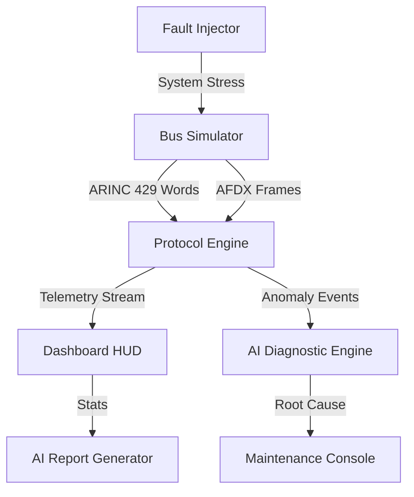

# AeroStream DX | Avionics Bus Diagnostic & PHM Platform

**AeroStream DX** is a professional-grade aerospace maintenance diagnostic and Predictive Health Management (PHM) platform. Designed for modern aircraft maintenance workstations, it provides real-time monitoring, bit-level protocol analysis, and AI-driven anomaly detection for ARINC 429 and AFDX (ARINC 664) bus systems.

---

## 🚀 Key Features

### 📡 High-Fidelity Protocol Engines
- **ARINC 429 Engine**: Bit-level word reconstruction, octal label decoding, SDI identification, and ODD parity validation.
- **AFDX (ARINC 664) Engine**: Virtual Link (VL) management, Bandwidth Allocation Gap (BAG) compliance monitoring, and sequence number integrity checking.

### 🧠 AI-Powered Diagnostics & PHM
- **Anomaly Detection**: Real-time detection of frozen values, signal spikes, and CRC/Parity violations using Genkit and Gemini 2.0.
- **Predictive Maintenance**: Remaining Useful Life (RUL) estimation for Engine, Hydraulic, Electrical, and Fuel subsystems.
- **Corrective Action Workflow**: Automated Fault Isolation Manual (FIM) step suggestions based on live telemetry.

### ✈️ Digital Twin Telemetry
- Real-time simulation of aircraft subsystems with high-frequency telemetry.
- Fault propagation modeling (e.g., how an engine thermal spike impacts bus parity).
- Scenario-based mission profiles (Normal, Hydraulic Failure, Engine Overheat, etc.).

---

## 🏗 System Architecture

---

## 🎖 Portfolio Impact & Technical Achievements

### 🛠 Technical Deep Dive
- **Protocol Engineering**: Implemented custom bit-masking logic for ARINC 429 ODD parity verification and AFDX sequence integrity.
- **Predictive Health Monitoring**: Developed a linear degradation model to estimate Remaining Useful Life (RUL) based on stress-weighted mission profiles.
- **Generative AI Integration**: Engineered Genkit flows with specialized system prompts to act as a Senior Avionics Architect for Root Cause Analysis (RCA).
- **HUD Interface**: Built a high-density, low-latency UI using Shadcn/UI and Recharts for real-time telemetry visualization.

### 🎯 Demonstration Scenarios
1. **Nominal Flight**: Observe stable bus utilization and 0% error rates.
2. **Hydraulic Leak**: Trigger via Scenario Controller; observe PSI drop and subsequent bus alarms.
3. **AI Diagnostic**: Execute the "AI Analysis" in the Maintenance Hub to see root cause suggestions.

---
## 📸 Screenshots

### Dashboard View
.png>)

### Telemetry and Bus Monitoring
.png>)

### Maintenance Hub
.png>)

### Scenario Controller
.png>)

### AI Diagnostic Panel
.png>)

---

## 🛠 Technology Stack

- **Frontend**: Next.js 15 (App Router), React 19, Tailwind CSS.
- **UI Components**: Shadcn UI, Lucide React (Icons).
- **AI/GenAI**: Genkit 1.x (Google Gemini 2.0 Flash).
- **Visualization**: Recharts (High-performance telemetry graphs).
- **Language**: TypeScript (Strict engineering types).

---

© 2025 AeroStream Technologies. For professional portfolio demonstration purposes only.
# AeroStream-DX-ARINC-429-AFDX-Digital-Twin-Predictive-Maintenance-Platform
