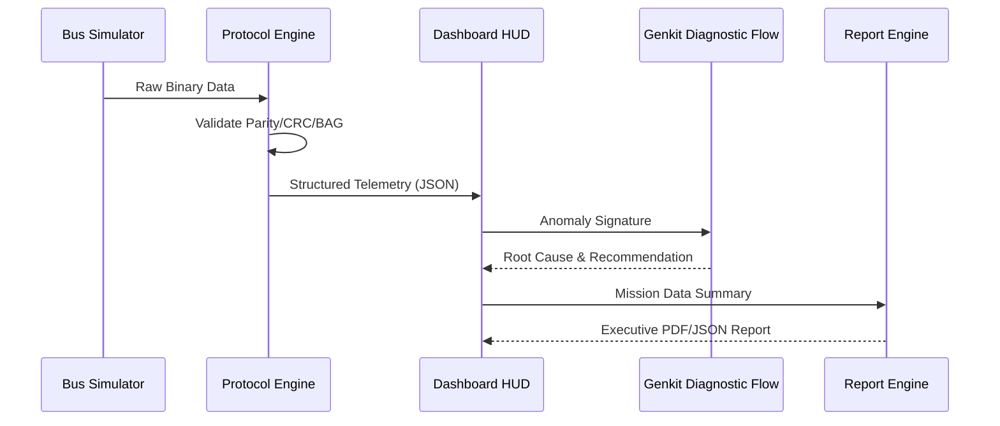

# AeroStream DX Technical Architecture

## 1. System Overview
AeroStream DX operates as a closed-loop diagnostic system where simulated hardware telemetry is processed by a protocol engine and analyzed by an AI diagnostic layer.

## 2. Data Flow Diagram

## 3. Protocol Processing Pipeline

### ARINC 429 Engine
- **Input**: 32-bit stream.
- **Decoding**: Label (Bits 1-8, Octal), SDI (9-10), Data (11-29), SSM (30-31).
- **Validation**: Bit 32 Parity (ODD).

### AFDX Engine
- **Virtual Links**: Logic routing based on VLID.
- **Traffic Policing**: BAG compliance check (ms latency jitter).
- **Integrity**: Sequence number gap detection.

## 4. Predictive Health (PHM) Logic
The system uses a linear degradation model combined with scenario-based stress factors:
- **Baseline**: RUL = MaxLife - FlightHours.
- **Stress**: RUL = Baseline * (1 - SeverityScore/100).
- **Alerting**: Trigger Warning at 200FH, Critical at 50FH.

## 5. AI Anomaly Detection (Genkit)
The `aiBusAnomalyAnalyzer` flow utilizes a prompt-engineered agent specializing in avionics. It evaluates:
1. **Statistical Outliers**: Throughput/Latency deviation.
2. **Protocol Violations**: Sudden bursts of parity/CRC errors.
3. **Mechanical Correlation**: Cross-referencing digital twin health (e.g., Engine Temp) with bus integrity.
